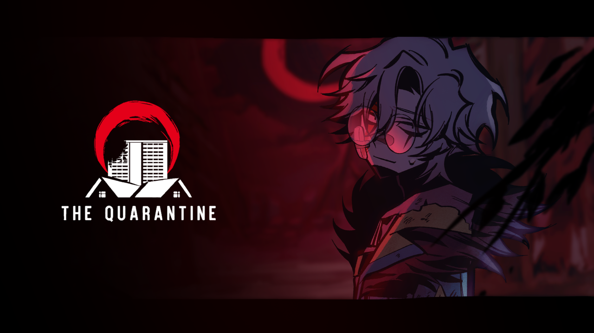
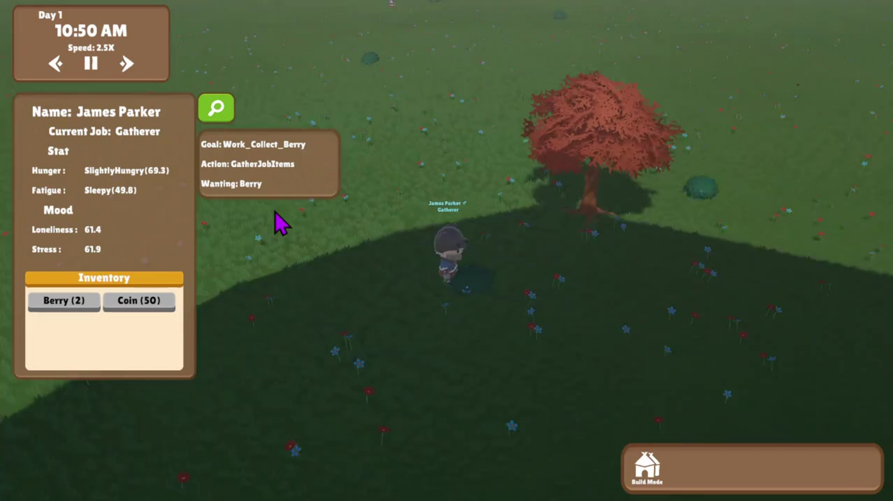

# Sahachoke Khwanchit (Few)
### Unity Game Developer | Systems & Gameplay

Unity developer specializing in **C# and system-driven gameplay development**, with experience building scalable systems such as **AI behaviors, inventory, dialogue frameworks, and data pipelines**.

I have contributed as a lead programmer on **award-winning projects** showcased at national and international events, and have experience working within production codebases, integrating data workflows, and solving technical challenges.

---

## Portfolio

🌐 **Full Portfolio:** https://philosophier.wixsite.com/home
📧 **Email:** sahachoke.khwa@gmail.com  

---

## Selected Projects

---

### 🎮 The Quarantine (Main Project)

**Role:** Project Coordinator / Programmer  
**Tech:** Unity, C#, Spine 2D  

- Designed and implemented core systems:
  - Inventory system  
  - Dialogue (VN-style) system  
  - AI behaviors (A* pathfinding)  
- Built modular system architecture for scalable development  
- Integrated Spine 2D animation into gameplay pipeline  
- Collaborated with cross-functional team to debug and refine gameplay  

🏆 Awards:
- Best Visual — Thailand Game Talent Showcase (2024)  
- Best of Pitching — BU Game On! Expo (2024)  
- Rising Star — BU Game On!  

---

### 🧠 GOAP AI Research Project

**Role:** Developer / Researcher  
**Tech:** Unity, C#, GOAP AI  

- Developed AI system using **Goal-Oriented Action Planning (GOAP)**  
- Implemented layered decision-making based on agent needs  
- Designed system to simulate dynamic and adaptive NPC behavior  
- Focused on scalable AI architecture for simulation-based gameplay
  
---

## Technical Highlights

- Gameplay Systems: Inventory, Dialogue, AI  
- AI: A* Pathfinding, GOAP (research-based)  
- Data Workflow: Spreadsheet → Unity pipeline  
- Programming: C#, OOP, scalable architecture  
- Tools: GitHub, JetBrains Rider, Spine 2D  

---

## About Me

- 🎓 Game & Interactive Media — Bangkok University
- 🌍 Experience working in international teams (Japan internship)  
- 🎤 Speaker & presenter in game development events  
- 🎮 Passionate about building scalable and maintainable game systems  

---
